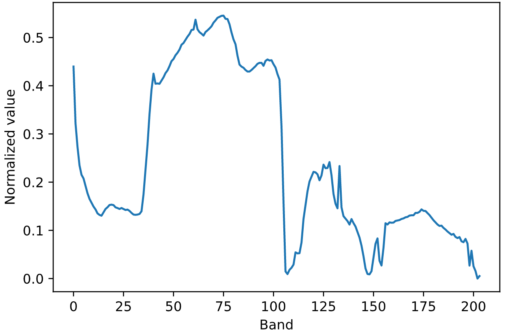
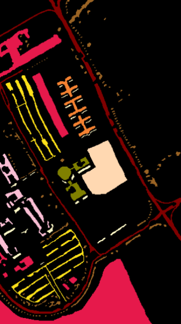

# HSI Classification Application

**Author: Zeno Dhaene** 
**Email: zeno.dhaene@gmail.com**

Developed for master dissertation "Classifying hyperspectral images:  combining researchand application" at Ghent University. A more in-depth book about this application and the accompanying novel multi-stream capsule network architecture can be found [here]().

## In this repository

This repository contains code for a complete software solution to classify hyperspectral images using supervised deep learning techniques. The code itself is located in the `src/` directory. If you want to learn how it works in detail and how to run it, I recommend you start of in the [docs/](./docs) directory.

## Short summary

Classifying hyperspectral images is the process of assigning each pixel in a hyperspectral image to a particular geological class, based on very few training samples. This creates a classification map for the entire dataset, which can be used for various purposes like agricultural land usage and climate research, among others.

Hyperspectral images consist of several grayscale images, where each layer represents the received spectral values for a particular spectral band. All these layers together (often 10s to 100s of layers) form a datacube which we call the hyperspectral image. Per pixel, we can obtain a vector of spectral values of all spectral bands, which is shown below

    

Below you can see an example of a classification result. On the left is a grayscale visualization of band 51 of the Pavia University hyperspectral dataset, which is frequently used in academic literature to solve the problem of hyperspectral classification. The second image shows the ground truth of the dataset, while the third dataset shows the predicted classification map of the hyperspectral image which was trained with a multi-stream capsule network architecture. With a very small subset of the pixels in the ground truth map (150 training samples per geological class), we are able to extract the complete predicted classification map for all pixels in the image. Compared to the ground truth, this particular map achieves an overall accuracy of 98.25%. For more information on the deep learning architecture that was used - which is included in the software - I refer to [the book - TODO](TODO). 

<table>
    <tr>
         &nbsp;
         &nbsp;
        
    </tr>
</table>

This application allows the user to upload datasets, manually indicate training samples, use existing or create supervised deep learning architectures, configure architecture parameters, and bundle these to schedule a model. For the built-in architecture, a GPU and correct drivers are required to actually train the model. More information on this can be found in the [technical requirements](./docs/technical_requirements.md).

The user can also use the tool to inspect their or other users' trained models, as well as display statistics like confusion maps, overall- and average accuracies, and the Kappa score.